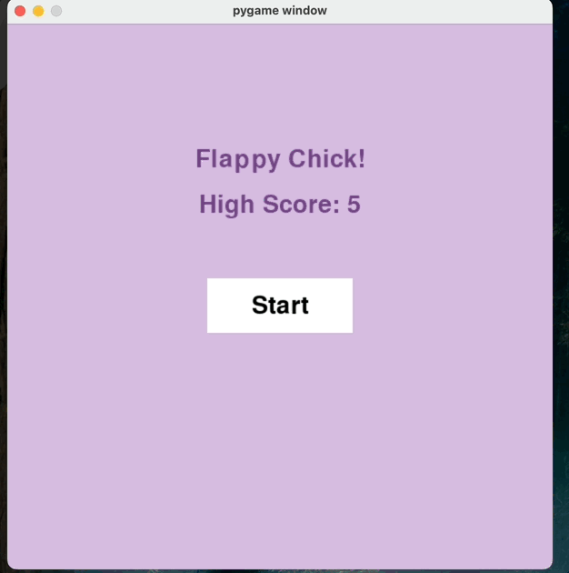

# Flappy Chick

A mini-game stemming from the iconic mobile game <strong>"Flappy Bird"</strong>. I made this fun mini project to practice with python and pygame.
- This game is primarily built with pygame.
- Features jumps, hits, and scoring.
- Also includes a moving UI design.
- Keeps track of high score in device 

## How to run
1. Clone Github Repo:  
    <code>git clone https://github.com/ashram15/FlappyChick.git</code>
2. Navigate to Project Directory  
   <code> cd FlappyChick </code>
3. Install all dependencies in <b>requirements.txt</b>  
    <code>pip install -r requirements.txt</code>
4. Run Program   
    <code>python3 FlappyChick.py</code>

## Gameplay
1. Press the space bar to navigate through the pipes.
2. Avoid hitting the pipes or falling
3. Try to beat your high score! 

## Built With  
- pygame
- python
